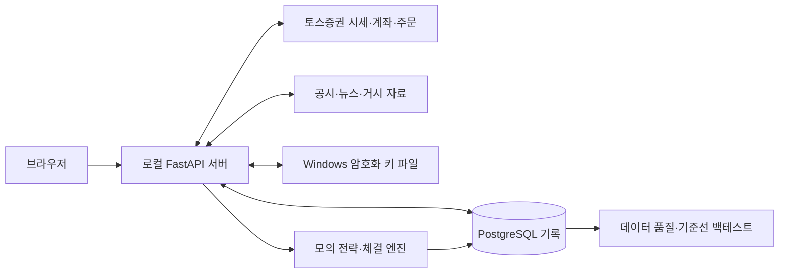

# FOLIO 프로젝트 소개

기준일: 2026-10-04

FOLIO는 국내주식 탐색, 기업 리서치, 실제 자산 확인과 모의 자동매매를 한곳에서 다루는 개인용 Windows 로컬 웹앱입니다. 실제 시세로 전략을 검증하고, 판단·체결·비용을 기록해 다음 실험의 근거를 남기는 데 초점을 두었습니다. 현재 실제 계좌 주문은 사용자가 확인하는 수동 주문만 제공합니다.

## 만들고자 한 것

종목을 찾고 기업을 분석하는 화면과 전략을 검증하는 환경이 따로 있으면, 투자 판단의 근거와 실행 결과를 이어서 보기 어렵습니다. 자동매매 역시 주문 성공 여부만 확인해서는 매수하지 않은 이유, 거래비용, 재시작 뒤 상태와 같은 운용 문제를 설명하기 어렵습니다.

이 프로젝트는 탐색 → 저장 → 전략 설정 → 모의 실행 → 결과 확인을 연결합니다. 개인 PC에서 실행하고 개인 설정·거래 기록을 보관하며, 증권사 연결이 실패해도 사이트에 로그인해 연결을 복구할 수 있게 구성했습니다.

## 지금 보여줄 수 있는 기능

| 사용자 흐름 | 구현 내용 |
|---|---|
| 종목 찾기 | 이름·코드·초성·두벌식 입력·등록된 영어·별명 검색, 시장·유형 필터, 실시간 시세와 상세 차트 |
| 기업 살펴보기 | 재무·가격 지표의 점수와 근거, 추천 기업·저장한 기업 분리, 개인 메모, 뉴스·공시 연결 |
| 내 자산 확인 | 실제 계좌 보유·현금, 조회 시 쌓이는 자산 이력, 자산 구성, 금액 가리기 |
| 전략 검증 | 분리된 두 모의계좌, 완료 1분봉 이동평균 신호, 비용·투자 한도·청산 조건, 현재 판단과 주문 기록 |
| 연결·실행 관리 | 사용자별 연결 소유 관계, 로컬 암호화 키, PIN, 재시작 복원, 휴장·거래 시간 제한, 간편 실행 |
| 다음 실험 준비 | 종목·시장·거시 자료와 모의 판단 수집, 품질 보고서, 비용 포함 기준선 백테스트 |

화면 이름과 주소, 세부 제한은 [현재 상태](CURRENT_STATE.md)에서 확인합니다. 디자인 시안은 예시 데이터이며 실제 자산·실험 성과로 제시하지 않습니다.

## 구성

Python·FastAPI는 조회·인증·전략 실행을 담당하고 PostgreSQL은 계정·설정·거래·학습용 기록을 보관합니다. 화면은 HTML·CSS·JavaScript로 구현했습니다. 현재는 단일 서버 프로세스를 사용하며 휴대폰 앱이나 공개 운영 서버는 없습니다. 코드별 책임은 [코드 구조](technical/PROJECT_STRUCTURE.md)에 정리했습니다.

## 설명할 가치가 있는 설계 선택

| 문제 | 선택한 방식 | 의미와 한계 |
|---|---|---|
| 검색 응답이 입력과 어긋남 | 종목 캐시 검색, 선택용 조회에서 시세 요청 제외, 이전 요청 취소·응답 순서 검사 | 입력한 조건에 맞는 결과를 유지합니다. 별명은 등록 목록이며 AI가 자동 학습하지 않습니다. |
| 실제 주문과 모의 결과가 섞임 | 계좌·주문 경로 분리, 모의 비용 반영, 실제 주문 PIN·중복 방지·상태 대조 | 모의 체결은 실제 체결 가능성을 증명하지 않습니다. 실제 자동매매는 별도 후속 작업입니다. |
| 전략을 바꿨을 때 기존 보유분의 청산 기준이 모호함 | 자동매수분에 전략·수량·취득 시각·청산 조건 저장 | 이전 전략 매수분을 원래 조건으로 관리합니다. 출처 미지정 보유분을 임의로 자동매수분에 편입하지 않습니다. |
| 재시작으로 설정·자산을 잃거나 주문이 자동 재개됨 | 자산·주문·선택 전략 저장, 재시작 시 정지 | 기록은 복원하되 실행은 사용자가 시작합니다. 실행 구간 성과 기준선은 아직 메모리 상태입니다. |
| 개인 키가 DB 백업·기기 이동에 섞임 | 연결 정보는 DB, 새 키는 Windows DPAPI 로컬 파일 | 다른 PC에서는 키를 재등록합니다. 기존 환경 설정 키는 `.env`를 사용합니다. |
| 주말·휴장·단일가 시간에 전략이 판단함 | 증권사 캘린더와 전략 운영 시간의 교집합, 확인 실패 시 대기 | 헤더 정규장 표시와 엔진의 연속 거래 구간은 범위를 구분합니다. |
| 백테스트가 미래 자료를 이용함 | 시점 제한 데이터 조회와 다음 봉 체결을 기준으로 재생 | 여러 거래일 검증과 모델 학습은 아직 남아 있습니다. |

## 확인한 근거와 아직 확인하지 않은 것

| 근거 | 확인 범위 | 남은 한계 |
|---|---|---|
| 인증·주문·전략·데이터 관련 자동 테스트 | 경계 조건과 오류·복원 처리. 날짜별 결과는 [변경 기록](records/CHANGELOG_HISTORY.md)과 [학습 진행](machine-learning/CURRENT_PROGRESS.md)에 기록 | 개별 테스트 통과를 전체 배포 검증으로 표현하지 않습니다. |
| 실제 수동 주문 확인 (2026-09-29) | 지정가 주문의 접수·체결·취소 및 재시작 후 브로커 상태 대조 | 자동매매·모델 운용 성과가 아닙니다. |
| DB 복원 확인 (2026-10-03) | 별도 임시 DB에서 34개 테이블의 행 수·내용 해시 일치 | 다른 PC의 설치·권한·키 재등록을 포함한 전체 이전 검증은 남았습니다. |
| 첫 기준선 백테스트 | 하루 일부 자료로 비용 포함 재생과 결과 저장 확인 | 표본이 부족합니다. 수익성이나 모델 개선 효과를 판단할 수 없습니다. |
| 화면 확인 | 기능별 예시 응답·배치·검색·좁은 화면 확인과 사용자의 실제 화면 점검 | 예시 화면 검증과 실제 계좌 연동 검증의 범위를 구분합니다. |

검증 명령·자료 위치는 각 상세 문서에 둡니다. 이번 문서 정리는 새로운 기능 검증이나 장중 운용 결과를 추가한 것이 아닙니다.

## 개발 방식과 포트폴리오에서의 설명

사용자가 제품 방향·기능 우선순위·화면과 운용 요구를 정하고 실제 화면을 확인했으며, AI 보조로 구현·문제 분석·자동 테스트·문서 정리를 진행했습니다. 생성된 화면을 그대로 채택하기보다 미리보기와 실제 화면의 차이, 검색 동기화, 계좌 전환, 중복 버튼과 용어를 반복 수정했습니다.

소개 자료에서는 사용 흐름과 위 설계 선택을 먼저 설명하고 코드·테스트·실제 확인 기록을 근거로 연결합니다. 개인 자산은 가리거나 예시 데이터로 바꾸고 예시임을 표시합니다. 아직 하지 않은 모델 학습·뉴스 특징 결합·실시간 모델 운용을 완료한 경험처럼 적지 않습니다.

추후 모델 실험을 소개할 때에는 데이터 기간·종목, 시간순 분할, 거래비용, 기준 전략과 비교 결과, 거래 수·낙폭, 실패한 실험과 한계를 함께 남깁니다. 현재는 이 결과물이 준비되지 않았습니다.

## 다음 단계

당장은 자료 품질과 장중 모의 운용을 확인합니다. 데이터가 준비되면 여러 거래일 기준선 검증 → 첫 모델 학습 → 모의매매 비교 순서로 진행합니다. 실제 자동매매·설치형 배포·휴대폰 확인은 그 이후의 별도 결정입니다. 구체적인 순서는 [로드맵](ROADMAP.md), 배포 구상은 [보류 계획](plans/DEPLOYMENT_AND_MODEL_PLAN.md)에 둡니다.
